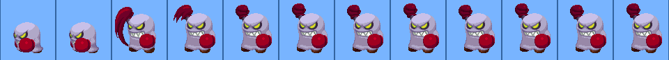

# SpritePlayer
A tiny js component for playing sprite animate pictures!

See the demo: http://fishenal.github.io/spritePlayer/player.html

# What it is?

A html player for playing pictures like this



this picture is from http://www.spriters-resource.com/ , thank you! 
and you can also get this kind of sprite picture from that site.

---

## Play source limit
- every frame must be same width, otherwise your animate is movine all the times.
- frames layout must be inline

# How to use?
1. link SpritePlayer.js to your html
```
<script type="text/javascript" src="./SpritePlayer.js"></script>
```
2. create your own player using ```new```
```
var newPlayer = new SpritePlayer({
    width: 80,
    height: 87,
    backgroundImage: 'images/boxer.png',
    speed: 100,
    forward: true,
    frameNum: 12
});
```
3. you can make some options when you ```new```
    - width   - the width of one frame and stage
    - height  - the stage height, often the picture height
    - backgroundImage - picture source url, a string no need 'url()'
    - speed  - msec for interval , less and faster
    - forward - boolean, determin the direction of playing
    - frameNum - total frame number, determin the background position loop times

4. there are two methods provide
  - run - begin playing
  - stop - stop playing, next ```run()``` will from the begining

5. see file player.html for more


